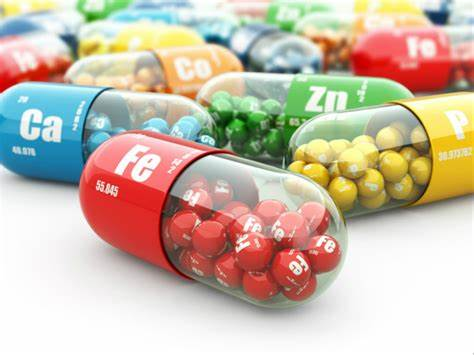

+++
title = "𝓑𝓵𝓸𝓰 𝓢𝓽𝓪𝓻𝓽𝓾𝓹𝓼 𝓢𝓾𝓹𝓹𝓵𝓮𝓶𝓮𝓷𝓽𝓼"
date = "2020-08-12"
draft = false
pinned = false
tags = ["Sport", "Gesundheit", "Nahrungsergänzungmittel", "Startups"]
image = "schwarz-weiss-bild.jpg"
description = "Erste Ideen sammeln und Pläne machen"
footnotes = ""
+++
Unser Ziel ist es Neueinsteiger zu helfen Ihre Produkte richtig zu vermarkten. Wir spezialisieren uns auf Nahrungsergänzungsmittel, ihre Wirkungen und die Gesundheit der Konsumenten. Wir helfen den Unternehmern die Produkte richtig zu vermarkten, dazu gehört Webseiten erstellen, Foto- Videos machen und bearbeiten, Produkte und Webseite designen sowie die Produkte über die Sozialen Medien vermarkten. Bevor wir starten möchten wir die nächsten Wochen daran arbeiten Interviewfragen zu erstellen und die Leute auf der Strasse zu befragen. Ich denke es ist wichtig, das man die Meinung der Leute hört, um diese dann in der Umsetzung mit einzubauen.

## Bilder

- - -